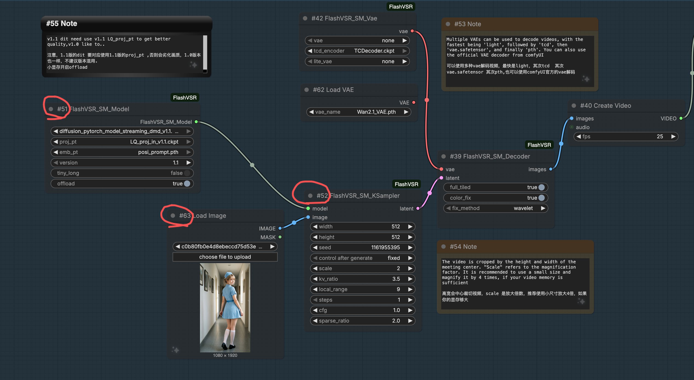

# ComfyUI-ShowNodeID

A lightweight frontend extension for ComfyUI that displays node IDs directly in the node title (e.g. `#57 FlashVSR_SM_Model`).

---

## ✨ Features

- 🔢 Show node ID directly in node title
- 🧩 Works with all nodes (including custom nodes)
- ⚡ Zero backend dependency (pure frontend JS)
- 🪶 Minimal and lightweight
- 🔧 No configuration required

---

## 📦 Installation

### Method 1 (Recommended)

1. Download this repository:

```bash
git clone https://github.com/YOUR_USERNAME/ComfyUI-ShowNodeID.git
```

2. Move it into your ComfyUI custom nodes directory:

```
ComfyUI/custom_nodes/ComfyUI-ShowNodeID/
```

3. Restart ComfyUI

4. Refresh your browser

---

### Method 2 (Manual)

1. Download ZIP and extract
2. Place folder into:

```
ComfyUI/custom_nodes/
```

3. Restart ComfyUI and refresh browser

---

## 🖥️ Result

After installation, node titles will change from:

```
FlashVSR_SM_Model
```

to:

```
#57 FlashVSR_SM_Model
```

---

## Example



## 🛠️ How It Works

This extension uses ComfyUI's frontend extension API:

```javascript
app.registerExtension(...)
```

It hooks into node rendering and prepends the node ID to the title.

---

## ⚠️ Notes

- This is a frontend-only plugin
- No impact on workflow execution
- Compatible with most ComfyUI versions
- If not working:
  - Check Settings → Extensions
  - Make sure the extension is enabled
  - Refresh browser (Ctrl + F5)

---

## ❤️ Use Cases

- Debugging complex workflows
- Matching nodes with exported JSON (id)
- Working with large pipelines (e.g. FlashVSR)
- Comparing workflows across platforms (RunningHub, etc.)

---

## 📄 License

MIT License

---

## 🙌 Credits

Inspired by the need for easier debugging in complex ComfyUI workflows.

---

## ⭐ Star if useful!

If this plugin helps you, consider giving it a star ⭐
